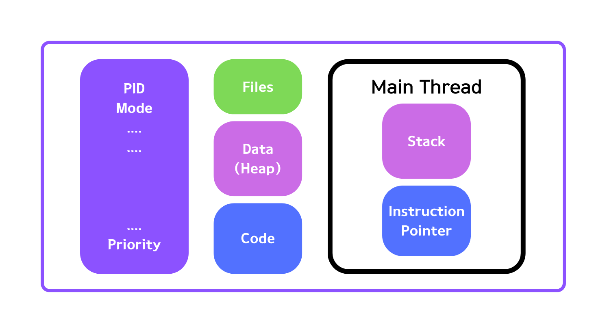

# java 멀티스레딩, 병행성 및 성능 최적화 공부 1일차
---
## 멀티스레딩이 필요한 이유
---
- 응답성
```
1. 형편없는 응답성은 상품성을 떨어뜨린다.
2. 사용자 인터페이스가 있는 경우 특히 두드러진다.
```
```
마치 동시에 진행하는 것처럼 보이는 것은 동시성(concurrency)라고 한다.
```
- 성능
```
1. 더 적은 하드웨어로 어플리케이션 개발을 가능하도록 한다.
```

## 운영체제
---
운영체제는 사용자 대신 하드웨어, cpu 등과 소통한다. 사용자가 어플리케이션을 실행하면 디스크에서 프로그램을 메모리로 가져와 프로그램의 인스턴스를 실행한다. 이 인스턴스는 '프로세스'로 각 프로세스는 시스템에서 실행되는 다른 프로세스와는 완전히 별개이다.


<p style="width:full;" align="center"><프로세스 구조></p>

힙에는 어플리케이션에 필요한 데이터를 가지고 있으며, '메인 스레드'라고 불리는 스레드가 하나는 존재한다. 각각의 스레드에는 스택과 Instruction Pointer를 지닌다. 또한 모든 스레드는 프로세스의 파일, 힙, 코드를 공유한다.

스택은 메모리 영역으로 지역 변수가 저장되고 기능이 실행되는 영역이고, Instruction pointer는 말 그대로 pointer로 스레드가 실행할 다음 명령어 주소를 가리키는 역할을 한다. 각각의 스레드는 특정 순간에 서로 다른 함수를 이용해 다른 명령을 수행한다.

### Context Switch
---
보통 프로세스가 코어보다 많고, 각 프로세스는 하나 이상의 스레드를 가진다. 각 스레드는 cpu 자원을 가지고 경쟁한다. 하나의 스레드 실행을 멈추고 다른 스레드를 실행하는 것이 컨텍스트 스위치이다. 컨텍스트 스위치는 너무 많은 스레드를 가동하게 되면 스래싱이 발생한다. 이는 컨텍스트 스위치에 의한 시간이 더 많이 소비되는 경우이다. 

다른 스레드로 전환할 때는 기존의 모든 데이터를 저장하고, 또 다른 스레드의 cpu와 메모리에 복원해야 한다. 리소스를 일반적으로 프로세스 내의 스레드들은 공유하는 리소스가 많아 프로세스보다 자원을 적게 사용한다. 따라서 같은 프로세스의 두 스레드가 다른 프로레스의 두 스레드 간의 컨텍스트 스위치보다 더 효율적이다. 

### Thread Scheduling
---
#### First Come First Serve
---
실행 시간이 긴 스레드가 먼저 도착하면, 다른 스레드들은 응답을 기다려야한다.

#### Shortest Job First
---
일반적으로 UI관련 작업은 속도가 빠르다. 따라서 UI관련 작업만 영원히 진행하게 될 수 있다. 

#### 일반적인 운영체제에서의 작동
---
'epoch'에 맞춰 진행한다. 타임 슬라이스에 따라 시간을 할당한다. 단, 타임 슬라이스의 양은 Dynamic Priority에 따라 달라질 수 있다. Dynamic Priority는 Static Priority + Bonus로 정적 우선순위는 개발자가 미리 정해놓는 것이며, 보너스는 운영체제에 의해 매순간 조절하는 것이다. 즉각적인 반영이 필요한 스레드나 인터랙티브 스레드에 우선권을 부여하며, 동시에 실행시간이 부족했던 작업을 놓치지 않고 진행한다.

### Process vs Multithreading
---
많은 데이터를 공유해야하는 경우 멀티스레딩을 이용하는 것이 좋다. 또한 스레드는 생성과 파기가 훨씬 빨라 같은 프로세스 내부에서 프로세스를 전환하는 것이 훨씬 성능이 좋다. 

하지만, 독립되면서 보안과 안정성이 필요한 경우 새로운 프로세스를 실행하는 것이 좋다. 또한 어플리케이션 하나가 스레드 하나로 인해 다운될 수도 있다.  